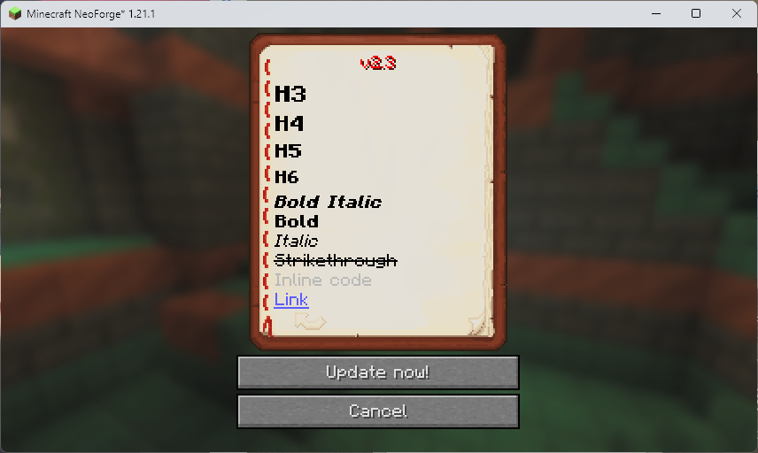

<div align="center">

<h1>SakuraUpdater</h1>
</div>

*([中文版请向下滚动 | Scroll down for Chinese version](#sakuraupdater-中文))*
## Introduction


SakuraUpdater is a NeoForge Minecraft mod that enables automatic synchronization of mod files between a server and clients, allowing players to receive server updates automatically, similar to other games.

<div align="center">

</div>

## Features

- [x] 🔄 Automatic server update checks
- [x] 🕒 Display update logs in the update UI
- [x] 📁 Multiple sync modes supported (mirror, push, ignore)
- [x] 🎮 Graphical update UI
- [x] 📊 Byte-accurate progress (total / downloaded / remaining, speed and ETA)
- [x] ⚙️ Configurable client and server settings
- [x] 🚀 The server can run independently

## Installation

### Server-side installation

1. Place `sakuraupdater-[version].jar` into the server's `mods` folder.
2. Start the server. Configuration files will be generated on first run.
3. Edit the server configuration file at `config/sakuraupdater-server.toml`.

### Client-side installation

1. Place `sakuraupdater-[version].jar` into the client's `mods` folder.
2. Start the game. Configuration files will be generated on first run.
3. Edit the client configuration file at `config/sakuraupdater-client.toml`.

### Server-side independent operation

1. Place `sakuraupdater-[version].jar` into a separate folder.
2. Run the server independently with `java -jar sakuraupdater-[version].jar`.
3. Edit the standalone server configuration file at `sakuraupdater-common.toml`.

### Runtime dependencies

The same JAR supports NeoForge and `java -jar` standalone operation. Dependencies are no longer bundled. Standalone startup obtains SQLite JDBC 3.46.0.0, Gson 2.10, NightConfig core/toml 3.8.1, and SLF4J api/simple 2.0.9. NeoForge servers only obtain SQLite when opening the database; ordinary clients do not download these libraries.

First startup needs internet access: downloads try Aliyun Central (`https://maven.aliyun.com/repository/central/`) first, then Maven Central (`https://repo.maven.apache.org/maven2/`). Files are cached in `lib/` relative to the process working directory. Every file is checked against a pinned SHA-256 before use; valid caches work offline and are not downloaded again.

To override the download source, set `SAKURAUPDATER_MAVEN_REPO` to an HTTP(S) Maven repository root before starting Java. For example, in PowerShell:

```powershell
$env:SAKURAUPDATER_MAVEN_REPO = "https://maven.aliyun.com/repository/central/"
java -jar sakuraupdater-[version].jar
```

A nonblank value **replaces both default sources**; if it fails, no public-source fallback is attempted. Unset or blank values retain the default Aliyun → Maven Central order. A trailing slash is optional. The URL must not include credentials, query parameters, or a fragment. This applies to standalone and NeoForge processes; restart the process after changing the variable. SHA-256 checks still apply to custom sources.

Without internet, complete valid caches allow normal startup with no network requests. Missing or corrupt required files trigger a download attempt; if every configured source fails, startup stops at that dependency. Each source is attempted once, with a 10-second connection timeout and a 60-second read timeout (these are not an overall startup deadline). Standalone startup exits with code 1; a NeoForge server reports a mod initialization error and cannot finish startup. Existing database files are not deleted. Ordinary clients do not require these downloads. An accessible LAN Maven repository can also supply missing files without public internet access.

For offline setup, copy the required versioned JAR files into `lib/` from a previously successful installation. Keep the exact filenames (for example, `sqlite-jdbc-3.46.0.0.jar`); standalone mode needs all six files. Existing valid `lib/` files from older releases can be reused. Lock files may remain and should not be removed while the application is running.

If acquisition fails, the log names the library, attempted URLs, and causes. Check network access and write permissions for `lib/`, or prepopulate verified files, then restart. Corrupt files are replaced only after a complete, verified download. A missing dependency or database initialization failure stops server startup. JARs are loaded directly; SQLite extracts its platform native library automatically, so its JVM temporary directory must be writable.

## Configuration

### Server configuration (`sakuraupdater-server.toml`)

```toml
# File server port
port = 25564

# Sync directory configuration, format: ["target_dir:mode:source_dir:extra_source_dir:..."]
# Mode explanations:
# - mirror: mirror mode, fully synchronize source directory to the target directory
# - push: push mode, push server files to clients
# - pull: pull mode, pull files from clients to the server
# - ignore: ignore mode, ignore files matching the regex. Since the path is included, ".*filename$" is recommended.
SYNC_DIR = [
    "mods:mirror",                           # synchronize the mods folder
    "config:push:clientconfig:config",       # push config and clientconfig to the client
    "resourcepacks:mirror",                  # synchronize resourcepacks folder
    "mods:ignore:.*abc\.jar$"                # ignore files in mods ending with 'abc.jar'
]
```

### Client configuration (`sakuraupdater-client.toml`)

```toml
# Server host address
host = "localhost"

# Server port (should match the sakuraupdater-server.toml configuration, especially if using frp or other proxies)
port = 25564

# Current client version (managed automatically; do not edit manually)
now_version = ""
```

## Usage

### 1. Server administrator operations

> ### When using the independent server, remove the /sakuraupdater command prefix and use the commit and data commands directly

#### Create a release/commit

`/sakuraupdater commit <version> <description-or-path-to-description-file>`

**Example:**
`/sakuraupdater commit v1.0.1 Fixed item duplication bug\nAdded new enchantments`

**Or using a text file (commonly used markdown supported):**
`/sakuraupdater commit v1.0.1 description.md`

#### Manage data versions

```shell
# List all versions
/sakuraupdater data list

# Show details for a specific version
/sakuraupdater data show v1.0.1

# Edit version description (only the description: the file list and the timestamp are left untouched)
/sakuraupdater data edit v1.0.1 "Updated version description"

# Rebuild a version's file list from the current sync directories
/sakuraupdater data repair v1.0.1

# Delete a version
/sakuraupdater data delete v1.0.1

# Clear all version data
/sakuraupdater data clear
```

> `data repair <version>` is for versions whose file list is empty — for example versions damaged by an older build's `data edit` bug, or versions that were never committed properly. It keeps the description and timestamp, so the order of your update log does not change. Note that it records the **current** contents of your sync directories, not a historical snapshot of that release.

#### File sizes and the update progress bar

The committed file list carries each file's size, which is what the client's update screen uses to show `total / downloaded / remaining` and to move the progress bar by bytes instead of by file count.

- A version committed by a **newer** server is already fine.
- A version committed by an **older** server has no sizes in its file list. The client then probes each file with a `Range: bytes=0-0` request before downloading (a short extra step), so byte progress still works — but the total can only be shown as a lower bound until a file finishes.
- To get the cleaner path, run `/sakuraupdater data repair <version>` on the version players are updating **to** (normally the newest one) after upgrading the server. `data show <version>` prints each file's size, so you can confirm the sizes are there. Only do this for the newest version: repair records the *current* contents of your sync directories.

### 2. Client player operations

#### Automatic update check

When a player joins the game, the client will automatically check whether the server has a newer version and will open the update UI if an update is available.

---

# SakuraUpdater (中文)

## 简介

SakuraUpdater 是一个 Minecraft NeoForge 模组，用于自动更新服务器的 mod 文件，让玩家能够像其他游戏一样自动获取服务器更新。

<div align="center">

</div>

## 功能特性

- [x] 🔄 自动检查服务器更新
- [x] 🕒 在更新界面显示更新日志
- [x] 📁 支持多种文件同步模式（mirror、push、ignore）
- [x] 🎮 图形化更新界面
- [x] 📊 按字节推进的进度（总共需要 / 已下载 / 剩余，含速度与预计剩余时间）
- [x] ⚙️ 可配置的客户端和服务器设置
- [x] 🚀 服务端可独立运行

## 安装步骤

### 服务器端安装

1. 将 `sakuraupdater-[version].jar` 放入服务器的 `mods` 文件夹。
2. 启动服务器，首次运行会生成配置文件。
3. 编辑 `config/sakuraupdater-server.toml` 配置文件。

### 客户端安装

1. 将 `sakuraupdater-[version].jar` 放入客户端的 `mods` 文件夹。
2. 启动游戏，首次运行会生成配置文件。
3. 编辑 `config/sakuraupdater-client.toml` 配置文件。

### 服务端独立运行

1. 将 `sakuraupdater-[version].jar` 放入单独文件夹。
2. 直接 `java -jar sakuraupdater-[version].jar` 即可运行服务端。
3. 编辑 `sakuraupdater-common.toml` 独立服务端配置文件。

### 运行时依赖

同一个 JAR 支持 NeoForge 模组和 `java -jar` 独立运行，依赖不再随包发布。独立模式启动时获取 SQLite JDBC 3.46.0.0、Gson 2.10、NightConfig core/toml 3.8.1、SLF4J api/simple 2.0.9。NeoForge 服务端仅在连接数据库时获取 SQLite；普通客户端不会下载这些依赖。

首次启动需要联网：优先使用阿里云 Central 镜像（`https://maven.aliyun.com/repository/central/`），失败后尝试 Maven Central（`https://repo.maven.apache.org/maven2/`）。文件缓存到进程工作目录下的 `lib/`，使用前检查固定 SHA-256；缓存有效时不再联网，支持离线启动。

如需指定下载源，在启动 Java 前设置环境变量 `SAKURAUPDATER_MAVEN_REPO`，值为 HTTP(S) Maven 仓库根地址。PowerShell 示例：

```powershell
$env:SAKURAUPDATER_MAVEN_REPO = "https://maven.aliyun.com/repository/central/"
java -jar sakuraupdater-[version].jar
```

非空值会**完全替换两个默认源**，自定义源失败时不会再访问公共源；未设置或只有空白时，仍按“阿里云 → Maven Central”尝试。末尾 `/` 可省略，地址不能带用户名、密码、查询参数或片段。独立模式与 NeoForge 模式均适用，修改后需要重启对应进程。自定义源下载的文件仍需通过固定 SHA-256 校验。

没网时，如果所需缓存完整且校验通过，程序正常启动，不发起下载。缺少依赖或缓存损坏时，会尝试下载；所有配置的源都失败后，在该依赖处终止启动。每个源仅尝试一次，连接超时 10 秒、读取超时 60 秒（并非整个启动过程的总时限）。独立模式退出码为 1；NeoForge 服务端会报告模组初始化错误，无法完成启动。已有数据库文件不会被删除，普通客户端也不会因为这些依赖无法下载而受影响。没有公网但能访问局域网 Maven 仓库时，也可以通过自定义源补齐依赖。

离线部署时，从已成功运行的安装目录复制对应版本的 JAR 到 `lib/`，保持原文件名（例如 `sqlite-jdbc-3.46.0.0.jar`）；独立模式需要全部 6 个文件。旧版本释放的有效 `lib/` 文件可直接复用。目录中的锁文件可以保留，不要在程序运行时删除。

获取失败时，日志会列出依赖名称、尝试的地址和失败原因。检查网络及 `lib/` 写入权限，或手动预置校验正确的文件后重启。损坏缓存仅在新文件完整下载并校验通过后替换；依赖获取或数据库初始化失败会终止服务端启动。JAR 直接加载，SQLite 原生库由驱动自动解压，JVM 临时目录需要可写。

## 配置说明

### 服务器配置 (`sakuraupdater-server.toml`)

```toml
# 文件服务器端口
port = 25564

# 同步目录配置，格式: ["目标目录:模式:源目录:额外的源目录:..."]
# 模式说明:
# - mirror: 镜像模式，完全同步源目录到目标目录
# - push: 推送模式，将服务器文件推送到客户端
# - pull: 拉取模式，从客户端拉取文件到服务器
# - ignore: 忽略模式，使用正则匹配忽略文件。匹配时前面带路径，推荐用 ".*文件名$" 格式。
SYNC_DIR = [
    "mods:mirror",                           # 同步 mods 文件夹
    "config:push:clientconfig:config",       # 将 config 和 clientconfig 推送到客户端
    "resourcepacks:mirror",                  # 同步资源包文件夹
    "mods:ignore:.*abc\.jar$"                # 忽略以 abc.jar 结尾的文件
]
```

### 客户端配置 (`sakuraupdater-client.toml`)

```toml
# 服务器主机地址
host = "localhost"

# 服务器端口（需与sakuraupdater-server.toml配置一致，如使用frp等代理后的端口）
port = 25564

# 当前客户端版本（自动管理，请勿手动修改）
now_version = ""
```

## 使用方法

### 1. 服务器管理员操作

> ### 在使用独立服务端时，需去除 /sakuraupdater 命令前缀，直接使用 commit、data 命令

#### 创建更新版本

`/sakuraupdater commit <版本号> <描述信息/描述文件路径>`

**例如:**
`/sakuraupdater commit v1.0.1 修复了物品复制bug\n添加了新的附魔`

**或使用文本文件(常见的md格式支持):**
`/sakuraupdater commit v1.0.1 description.md`

#### 管理数据版本

```shell
# 查看所有版本
/sakuraupdater data list

# 查看特定版本详情
/sakuraupdater data show v1.0.1

# 编辑版本描述（只改描述：文件清单与时间戳都不会被动）
/sakuraupdater data edit v1.0.1 "更新了版本描述"

# 重建某个版本的文件清单（按当前同步目录重新扫描）
/sakuraupdater data repair v1.0.1

# 删除版本
/sakuraupdater data delete v1.0.1

# 清空所有版本数据
/sakuraupdater data clear
```

> `data repair <版本>` 用于文件清单为空的版本——例如被旧版本 `data edit` 的 bug 清空过的版本，或当时没 commit 好的版本。它会保留描述与时间戳，所以不会打乱更新日志的顺序。注意：它记录的是**当前**同步目录里的内容，不是那一版当时的历史快照。

#### 文件体积与更新进度条

commit 出来的文件清单会带上每个文件的体积。客户端的更新界面靠它显示"总共需要 / 已下载 / 剩余"，并按字节而不是按文件个数推进进度条。

- 用**新版服务端** commit 的版本直接就是好的。
- 用**旧版服务端** commit 的版本，清单里没有体积。客户端会在下载前对每个文件发一个 `Range: bytes=0-0` 探测（多一个很短的准备阶段），字节进度依然可用，只是文件下载完成前总量只能显示成下限。
- 想要干净的正路径：升级服务端后，对玩家要更新**到**的那个版本（通常就是最新版）跑一次 `/sakuraupdater data repair <版本>`。`data show <版本>` 会把每个文件的体积打出来，方便确认。只对最新版本这么做——repair 记录的是同步目录**当前**的内容。

### 2. 客户端玩家操作

#### 自动检查更新

当玩家进入游戏时，如果检测到服务器有新版本，会自动弹出更新界面。
